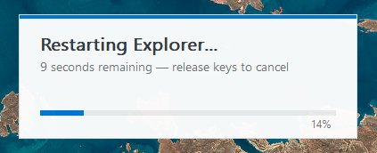

# eee

Hold **Ctrl+Alt+Shift+E** for 10 seconds to restart `explorer.exe`.



A tiny (~250KB) Windows utility that runs silently in the background. When you hold down the hotkey combo, a countdown overlay appears. Release early to cancel, or hold to completion to kill and restart Explorer.

## Install

Download `eee.exe` from [Releases](https://github.com/levkropp/eee/releases) and double-click it. That's it.

It copies itself to `%LOCALAPPDATA%\eee\`, creates a scheduled task that starts at logon, and begins running immediately. You'll never need to think about it again.

You can also install from the command line with `eee.exe install`.

## Uninstall

Open **Settings > Apps > Installed apps**, find **eee**, and click Uninstall.

Or from the command line:

```
eee.exe uninstall
```

## Features

- Single-instance (duplicate launches silently exit)
- Runs at startup via Windows Task Scheduler
- No tray icon, no window, completely invisible until triggered
- Windows 11-styled overlay with progress bar
- Works on Windows 10 and 11

## Building

```
cargo build --release
```

Output: `target/release/eee.exe`

## License

GPL-3.0
